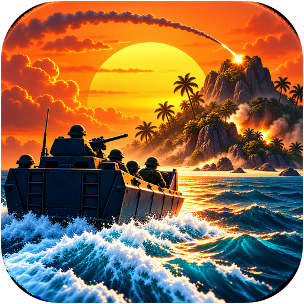

# 潮汐前線 · Tidal Front v0.6.8.5

[English](README.md) · [简体中文](README.zh-CN.md) · **日本語**



島を舞台に、基地建設、資源生産、NPC 基地との攻防を楽しめる、オフラインの 3D 戦略ゲームです。防衛設備を建て、部隊を訓練し、上陸艇を編成して、砲艦の支援を受けながら海岸へ上陸します。

ゲームは WebGL2 と JavaScript を使ってブラウザーで動作し、小さな C++17 サーバーが自分のパソコン上でファイルを配信します。ソースコード、画像、音楽、効果音はすべてリポジトリに含まれています。ダウンロード後はオフラインで遊べ、アカウント登録、広告、アプリ内課金はありません。

[インストール](#インストールと起動) · [遊び方](#遊び方) · [操作](#操作) · [開発と検証](#開発と検証) · [開発への参加](CONTRIBUTING.ja.md) · [音楽クレジット](CREDITS.ja.md)

## 特徴

- **島の基地を育てる：**金貨、木材、鋼材を生産し、倉庫や司令部を強化して、7 種類の防衛設備を解放できます。
- **上陸部隊を編成する：**ライフル兵、重機関銃兵、ロケット兵、戦車、衛生兵を使用できます。上陸艇 1 隻につき兵種は 1 種類で、司令部を強化すると最大 8 隻まで解放されます。
- **海上から攻撃を支援する：**砲艦の兵器を照準し、海岸に上陸艇を投入すると、部隊がゲームの戦闘ルールに従って進軍します。
- **昼夜の変化を楽しむ：**ゲーム内の 1 日は実時間の 12 分です。朝、昼、夕方、夜ごとに光、戦闘効果、状況に応じた音楽が変わります。
- **実際の装備を確認する：**装備島では Lv.1–10 のゲーム内モデルと実射デモを確認できます。建物と艦艇の 18 種類に、計 180 枚の独立したレベル画像があります。
- **進行をローカルに保存する：**ブラウザーのセーブ、NPC による防衛イベント、再現可能な戦闘リプレイがローカルで動作します。
- **言語を選ぶ：**English、簡体字中国語、日本語に対応しています。初回はブラウザーの対応言語を選び、該当しない場合は英語になります。手動で保存した設定が優先されます。

## v0.6.8.5 の更新

- ドローンのモデルは、簡素な初期装備から未来的な設計まで 4 つの時代に進化します。後期モデルには 4 つの中空ローターガードがあり、Lv.10 には固有の細部が追加されています。
- ドローンの始動、離陸、ホバリング、飛行、帰還、着陸、停止が滑らかに変化します。1 回の出撃で投下する手榴弾は 1 個です。標的が無効になると帰還し、次の出撃で標的を選び直します。
- 現在の戦闘ルールは **30** です。ルール 29 以前で記録された戦報は、当時のドローン挙動を維持します。
- 180 枚の独立したレベル画像を建設、詳細表示、強化プレビューに組み込みました。初回の表示言語はブラウザーの設定に従います。

## インストールと起動

### 必要な環境

- Linux と Bash。
- C++17 に対応する g++。
- WebGL2 と Ogg 音声に対応するブラウザー。

Node.js は開発時の検証に使います。ゲームを遊ぶためには必要ありません。

Ubuntu / Debian では、必要に応じてコンパイラーと Git をインストールしてください。

```bash
sudo apt-get install g++ git
```

### クローンして起動する

```bash
git clone https://github.com/lingsie/Tidal-Front.git
cd Tidal-Front
./install.sh
```

**Code → Download ZIP**、または [main ブランチのダウンロード](https://github.com/lingsie/Tidal-Front/archive/refs/heads/main.zip)も利用できます。展開後に `Tidal-Front-main` ディレクトリで実行してください。

```bash
bash install.sh
```

Linux 配布用 ZIP をすでに持っている場合は、その中の `tidal-front-3d` ディレクトリで同じコマンドを実行します。画像と音声はすべて同梱されています。スクリプトはソースから `tidal-front-server` をビルドし、次のアドレスを開きます。

**http://127.0.0.1:8787/?v=0.6.8.5**

ブラウザーが自動で開かない場合は、このアドレスにアクセスしてください。端末で **Ctrl+C** を押すとゲームサーバーを停止できます。既定のポートを別のアプリケーションが使用している場合は、別のポートを指定します。

```bash
TIDAL_PORT=8788 ./install.sh
```

ゲーム内の ♫ ボタンで音声を有効にできます。設定画面には音量と音声互換モードがあります。

## セーブと更新

セーブ形式は **5** で、ゲームのアドレスに対応するブラウザーの `localStorage` に保存されます。続きを遊ぶには、同じブラウザー、ホスト名、ポートを使ってください。いずれかを変更すると別の保存領域になります。プロジェクトのフォルダーをコピーしてもブラウザーのセーブは移りません。このサイトのブラウザーデータを消去すると、対応するセーブも削除されます。

Git でインストールした場合は Ctrl+C でサーバーを停止してから、プロジェクトのディレクトリで更新して再起動します。

```bash
git pull --ff-only
./install.sh
```

ZIP を使う場合は新しい版をダウンロードして展開し、同じアドレスで起動してください。対応する旧セーブは読み込み時に移行されます。以前の単一ファイル版 `file://` のセーブは別のブラウザーオリジンに属するため、自動では移りません。

## 遊び方

新しい基地には司令部だけがあります。建設ショップで金鉱、製材所、製鉄所、防衛設備を建てましょう。生産施設の資源を倉庫に回収し、次の司令部レベルへの条件を満たすよう基地を育てます。

建物の建設と建物・艦艇の強化は、**1 つの工事枠**を共有します。兵種と砲艦兵器の強化には別の **訓練枠**があり、2 つの枠は並行して使えます。訓練は兵種のレベルを上げる操作です。兵員の補充や兵種の変更は、その兵員を載せる上陸艇ごとに行います。

### 防衛設備の解放

| 司令部レベル | 新たに解放される防衛設備 |
| ---: | --- |
| 1 | 狙撃塔 |
| 2 | 重機関銃 |
| 3 | 迫撃砲 |
| 4 | キャノン砲 |
| 5 | ロケットランチャー |
| 6 | 対戦車ミサイルラック |
| 7 | ドローン発着場 |

司令部の上限は **Lv.10** です。建物、兵種、艦艇のレベルは司令部レベルに制限され、砲艦兵器は砲艦レベルにも制限されます。基地ごとにドローン発着場と金庫をそれぞれ 1 つまで建てられます。

NPC 基地を偵察し、防衛設備と時刻を確認してから攻撃します。上陸艇は海岸から 1 隻ずつ投入し、砲艦スキルはエネルギーを使って支援します。戦闘はゲーム内の 1 日以内に決着させる必要があります。戦報は当時のルールと操作コマンドを保存し、同じ戦闘を再現します。

## 操作

| 入力 | 操作 |
| --- | --- |
| 建物や停泊中の艦艇を左クリック | 情報と操作を開く |
| 右ドラッグ | 視点を回転する |
| 中ボタンドラッグ、または Shift + 右ドラッグ | 視点を平行移動する |
| マウスホイール | 通常の場面で拡大・縮小する。装備島は固定の近景 |
| 建物の移動中に左クリック | 配置できる位置を確定する |
| 移動中に右クリック、X または Esc | 移動を取り消す |
| 数字キー 1–8、または上陸艇カード | 戦闘中に使用可能な上陸艇を選ぶ |
| 上陸艇を選んで海岸をクリック | その上陸艇を投入する |
| Space | 一時停止する |

## プロジェクト構成

| パス | 役割 |
| --- | --- |
| `index.html`、`src/style.css` | ページ構造とレイアウト |
| `src/main.js` | UI、入力、ゲームの進行 |
| `src/core.js` | 経済、戦闘、NPC、セーブ、リプレイのルール |
| `src/render.js` | WebGL2 描画、モデル、アニメーション |
| `src/previews.js` | プレビュー画像のパスとレベル選択 |
| `src/i18n.js` | ゲーム内の言語処理 |
| `assets/` | 画像、音楽、効果音、生成スクリプト |
| `server.cpp`、`install.sh` | ローカルファイルサーバーと起動スクリプト |
| `tests/`、`package.json` | 開発時の検証と npm コマンド |
| `CREDITS.ja.md` | 音楽の出典、クレジット、編集内容 |

`.gitignore` はビルドした実行ファイル、ZIP、ログ、ローカルキャッシュを除外します。遊ぶために必要な画像と音声はソースと一緒に管理しています。

## 開発と検証

**Node.js 22 以降**を使用してください。npm パッケージへの依存がないため、事前の `npm install` は不要です。`package.json` は ES module を指定し、既存の検証をまとめて実行できます。

```bash
npm test
```

ゲームルール、UI / WebGL の呼び出し、発射機構、武器、180 枚のレベル画像、v0.6.8.4 / v0.6.8.5 の回帰を検証します。UI 検証は軽量な DOM / WebGL の代替実装を使うため、変更に関係する画面、入力、音声は実際のブラウザーでも確認してください。

音声の検証には **FFmpeg と ffprobe** が必要です。戦闘の一括シミュレーションは個別に実行できます。

```bash
npm run test:audio
npm run test:simulate -- 1000
```

開発上の約束と不具合の報告方法は [CONTRIBUTING.ja.md](CONTRIBUTING.ja.md) を参照してください。

## 音楽と開発状況

Kevin MacLeod の楽曲について、出典リンク、CC BY 4.0 のクレジット、ループ用の編集内容を [CREDITS.ja.md](CREDITS.ja.md) に記載しています。ゲーム内の設定画面にも同じクレジットがあります。

現在の版は、ローカルでの基地建設と NPC 戦に重点を置いた、遊べる Linux 向け試作版です。ゲーム内モデルはプログラムで生成した 3D 形状で、プレビューには別途描いた画像を使用しています。不具合や改善案は [GitHub Issues](https://github.com/lingsie/Tidal-Front/issues) にお寄せください。
